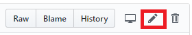
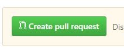

### 이곳은 무엇을 하는 곳인가요?

이 저장소는 제국의 위안부 책을 웹으로 변환하는 오픈소스 프로젝트입니다.

책 내용을 보려면 [링크](https://voiceofearp.github.io/website/books/제국의위안부/)로 들어가서 보실 수 있습니다.

### 무엇이 필요한가요?

`제국의 위안부`를 웹 상으로 쉽게 볼 수 있도록 만들었습니다. 그러나 텍스트 변환 과정에서 문제점이 많아, 오타와 띄워쓰기 오류가 있습니다.

아쉽게도 이 문제점은 프로그램적으로 해결할 수 없어서 일일히 오타를 찾고 수정하였는데요. 혼자 하기엔 벅찬 점이 있습니다.

이 책을 웹 상으로 쉽게 볼 수 있게 만드는데 의미가 있다고 생각하시는 분이 계시다면, 같이 수정해주실 `기여자🤗`가 되어주세요.

### 어떻게 수정하나요?

위키 느낌으로 수정해주시면 됩니다. 수정 기록은 모두 남으며, 최종적으로 관리자가 승인한 변경 기록만 웹 상으로 반영이 됩니다. 아래의 순서로 진행하시면 됩니다.

1. [Github](https://github.com/)에 가입해주세요.

2. [책 목차](books/제국의-위안부/index.md)로 들어가신 후, 수정하고자 하는 문서로 들어갑니다.

3. 수정할 문서에서  아이콘을 클릭합니다.

4. 문서를 수정 후,  버튼을 누릅니다.

5. 수정한 텍스트가 무엇인지 확인 후,  버튼을 누릅니다.

6. 수정 요청이 완료되었습니다! (이젠 제가 해야할 일이 남겠죠..!)

### 참고

> 원본 PDF는 [제국의 위안부 제 2판 PDF](https://drive.google.com/file/d/0BzyDl5n0BFcqU3lXUHZjeVc4Z28/view?usp=sharing)에서 받으실 수 있습니다.